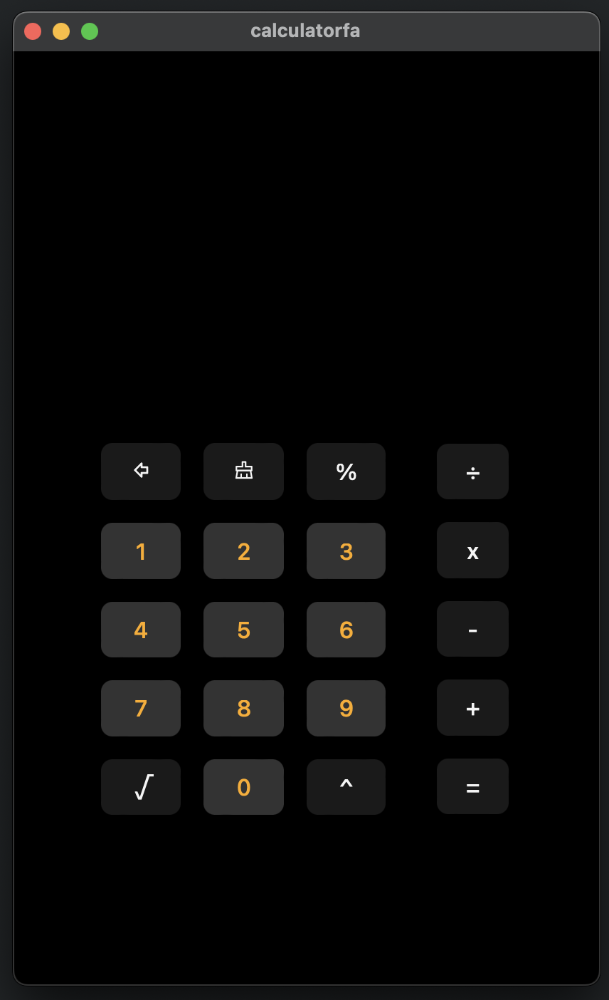

   

<h1 align="center">
Calculatorfa
</h1>

  

<h3 align="center">
  <a href="https://github.com/Foshati/Calculatorfa?tab=GPL-3.0-1-ov-file#">License</a> •
  <a href="https://github.com/Foshati/Calculatorfa/releases/tag/v1.0.0">Download</a> •
  <a href="https://github.com/Foshati/Calculatorfa/blob/main/CONTRIBUTING.md">How to Contribute</a> •
  <a href="https://github.com/Foshati/Calculatorfa/blob/main/CODE_OF_CONDUCT.md">Code of Conduct</a>
</h3>

___

**Please note:** This README is under development, just like Calculatorfa itself. We're constantly working on improving features and functionality.

___

  

Calculatorfa is a powerful and easy-to-use desktop calculator application. 

___

# Tauri + React

This template is the foundation for building Calculatorfa with Tauri and React in Vite.

## Recommended IDE Setup

- [VS Code](https://code.visualstudio.com/) + [Tauri](https://marketplace.visualstudio.com/items?itemName=tauri-apps.tauri-vscode) +[React](https://react.dev/) + [rust-analyzer](https://marketplace.visualstudio.com/items?itemName=rust-lang.rust-analyzer) 