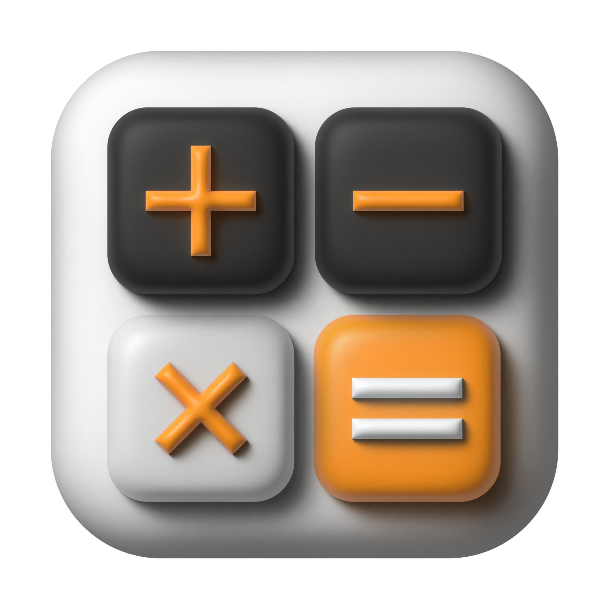

   

<h1 align="center">
Calculatorfa
</h1>

  

<h3 align="center">
  <a href="https://github.com/mellobacon/Nucleus/blob/d704ed7892344480fb6fcd3c94ef534f52cadc31/LICENSE">License</a> •
  <a href="https://github.com/mellobacon/Nucleus/releases">Download</a> •
  <a href="https://github.com/mellobacon/Nucleus/blob/master/CONTRIBUTING.md">How to Contribute</a> •
  <a href="https://github.com/mellobacon/Nucleus/blob/master/CODE_OF_CONDUCT.md">Code of Conduct</a>
</h3>

___

Please note that Nucleus is currently being rewritten. Features are being reworked and will be added again later. Refer to PR [#59](https://github.com/mellobacon/Nucleus/pull/59).
___

Nucleus is a text editor featuring a clean and easy to use user interface inspired by Visual Studio Code, Atom, Fleet, and others.

___

# Tauri + React

This template should help get you started developing with Tauri and React in Vite.

## Recommended IDE Setup

- [VS Code](https://code.visualstudio.com/) + [Tauri](https://marketplace.visualstudio.com/items?itemName=tauri-apps.tauri-vscode) + [rust-analyzer](https://marketplace.visualstudio.com/items?itemName=rust-lang.rust-analyzer)

